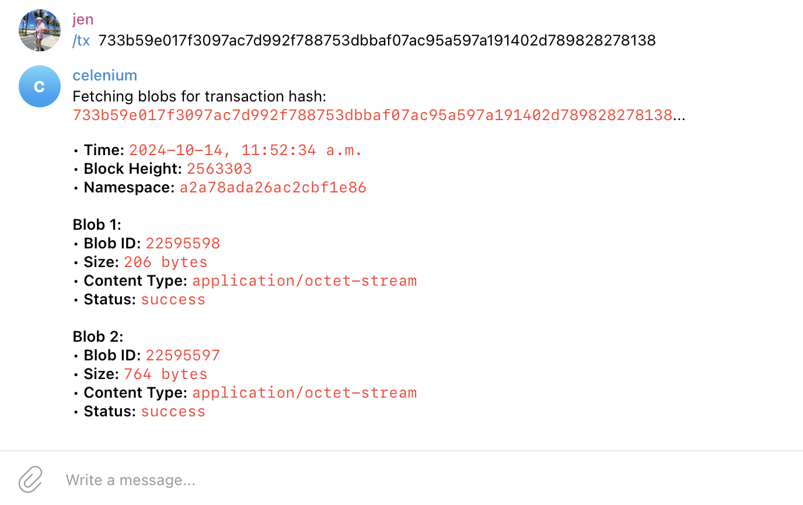

# Celenium API Telegram Bot – Transaction Information for Celestia

This Telegram Bot retrieves and displays transaction information on the Celestia blockchain using the Celenium API. The bot provides the namespace, time and associated blob details of a transaction when prompted with the `/tx` command in a Telegram chat.

## 📝 Project Description

This Telegram Bot leverages the Celenium API to:

- Display some details of a transaction on the Celestia blockchain.
- Provide this information in response to the `/tx` command within a Telegram chat.

The bot offers a simple way to retrieve transaction data and can be extended to add additional functionality.

## 📚 Prerequisites

Before setting up the project, ensure you have the following:

- **Node.js** installed
- **npm**, **yarn** or another package manager
- **Telegram Bot API Token** (you can get this by creating a bot via BotFather)

## ⚙️ Setup & Installation

1. Clone the repository and navigate into the project directory using `cd celenium-bot`.
2. Install dependencies: run `npm install`.
3. Create an `.env` file using the example and add your Telegram API token.
4. Run the bot: execute `node index.js` to start the bot.
5. Start using the bot: Open Telegram, start a chat with your bot, and use the `/tx` command to retrieve transaction information on Celestia.

## 🚀 How It Works

The bot responds to the `/tx` command by fetching the transaction status, type, and associated blobs from Celestia using the Celenium API. This information is then displayed in the Telegram chat.

## 🤖 Extending the Bot

This bot can be extended to add more functionality, such as monitoring additional endpoints or providing more detailed transaction metrics.
